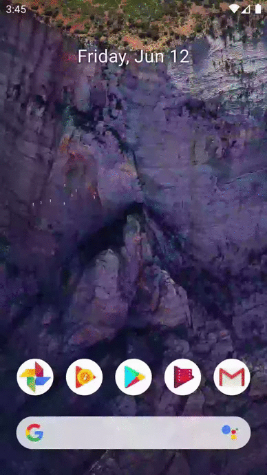

 

Flutter is Google's UI toolkit for building beautiful, natively compiled applications for mobile, web, and desktop from a single codebase. Flutter works with existing code, is used by developers and organizations around the world, and is free and open source.

## About Magic 8 Ball

This repository features a magic 8 ball app, it will give you the answers to all the tough questions in life. You can make the ball change at the push of a button.

